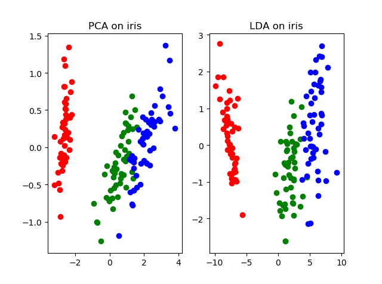
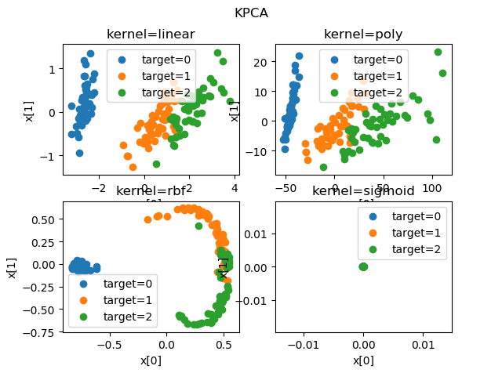

## Iris数据集使用PCA/LDA/KPCA降维的结果比较

### 一、实验描述

分别使用[PCA](<https://en.wikipedia.org/wiki/Principal_component_analysis>)、[LDA](<https://en.wikipedia.org/wiki/Linear_discriminant_analysis>)和[KPCA](<https://en.wikipedia.org/wiki/Kernel_principal_component_analysis>)方法对[Iris](<https://www.kaggle.com/arshid/iris-flower-dataset>)数据集进行降维，利用可视化工具比较降维的效果。

### 二、分析及设计

##### Principal component analysis(PCA) 算法简介

PCA的思想就是将n维特征映射到k维上(k<n)，这k维是重新构造出来的全新维度特征，而不是简单的从n维特征去除n-k维特征，这k维就是主成分。

1. 对数据中心化
2. 求特征的协方差矩阵
3. 求协方差矩阵的特征值和特征向量
4. 取最大的k个特征值所对应的特征向量
5. 将样本点投影到选取的特征向量上

##### Linear Discriminant Analysis(LDA) 算法简介

可以参考[这篇教程](https://www.cnblogs.com/jiahuaking/p/3938541.html)

##### Kernel Principal component analysis(KPCA) 算法简介

KernelPCA是PCA的一个改进版，它将非线性可分的数据转换到一个适合对齐进行线性分类的新的低维子空间上，核PCA可以通过非线性映射将数据转换到一个高维空间中，在高维空间中使用PCA将其映射到另一个低维空间中，并通过线性分类器对样本进行划分。

核函数：通过两个向量点积来度量向量间相似度的函数。常用函数有：多项式核、双曲正切核、径向基和函数(RBF) (高斯核函数)等。

### 三、详细实现

1. **导入需要的模块以及数据**

```python
from sklearn.datasets import load_iris
import numpy as np
from sklearn import decomposition
import matplotlib.pyplot as plt
```

```python
def load_data():
    return load_iris()

def load_data_tag():
    iris = load_data()
    return iris.data, iris.target
```

2. **PCA**

```python
def PCA(data, n):
    from sklearn.decomposition import PCA
    pca = PCA(n_components=n)
    pca_result = pca.fit_transform(data.data)
    return pca_result
```

3. **LDA**

```python
def LDA(data, n):
    from sklearn.discriminant_analysis import LinearDiscriminantAnalysis as LDA
    lda = LDA(n_components=n)
    lda_result = lda.fit_transform(data.data, data.target)
    return lda_result
```

4. **KPCA及其可视化**

```python
def plot_KPCA(*data):
    X, y = data
    kernels = ['linear', 'poly', 'rbf', 'sigmoid']
    fig = plt.figure()

    for i, kernel in enumerate(kernels):
        kpca = decomposition.KernelPCA(n_components=2, kernel=kernel)
        kpca.fit(X)
        X_r = kpca.transform(X)
        ax = fig.add_subplot(2, 2, i + 1)
        for label in np.unique(y):
            position = y == label
            ax.scatter(X_r[position, 0], X_r[position, 1], label="target=%d" % label)
            ax.set_xlabel('x[0]')
            ax.set_ylabel('x[1]')
            ax.legend(loc='best')
            ax.set_title('kernel=%s' % kernel)
    plt.suptitle("KPCA")
    plt.show()
```

5. **PCA和LDA的可视化**

```python
def plot(data, n):
    pca_result = PCA(data, n)
    lda_result = LDA(data, n)

    plt.subplot(1, 2, 1)
    plt.scatter(pca_result[data.target == 0, 0], pca_result[data.target == 0, 1], color='r')
    plt.scatter(pca_result[data.target == 1, 0], pca_result[data.target == 1, 1], color='g')
    plt.scatter(pca_result[data.target == 2, 0], pca_result[data.target == 2, 1], color='b')
    plt.title('PCA on iris')

    plt.subplot(1, 2, 2)
    plt.scatter(lda_result[data.target == 0, 0], lda_result[data.target == 0, 1], color='r')
    plt.scatter(lda_result[data.target == 1, 0], lda_result[data.target == 1, 1], color='g')
    plt.scatter(lda_result[data.target == 2, 0], lda_result[data.target == 2, 1], color='b')
    plt.title('LDA on iris')

    plt.show()
```

### 四、实验结果





### 五、心得体会

简单总结如下：

PCA为非监督降维，LDA为有监督降维。
PCA希望投影后的数据方差尽可能的大（最大可分性），因为其假设方差越多，则所包含的信息越多；而LDA则希望投影后相同类别的组内方差小，而组间方差大。LDA能合理运用标签信息，使得投影后的维度具有判别性，不同类别的数据尽可能的分开。

举个简单的例子，在语音识别领域，如果单纯用PCA降维，则可能功能仅仅是过滤掉了噪声，还是无法很好的区别人声，但如果有标签识别，用LDA进行降维，则降维后的数据会使得每个人的声音都具有可分性，同样的原理也适用于脸部特征识别。
所以，可以归纳总结为有标签就尽可能的利用标签的数据（LDA），而对于纯粹的非监督任务，则还是得用PCA进行数据降维。

KPCA与PCA具有本质上的区别：PCA是基于指标的，而KPCA是基于样本的。KPCA不仅适合于解决非线性特征提取问题，而且它还能比PCA提供更多的特征数目和更多的特征质量，因为前者可提供的特征数目与输入样本的数目是相等的，而后者的特征数目仅为输入样本的维数。KPCA的优势是可以最大限度地抽取指标的信息；但是KPCA抽取指标的实际意义不是很明确，计算也比PCA复杂。